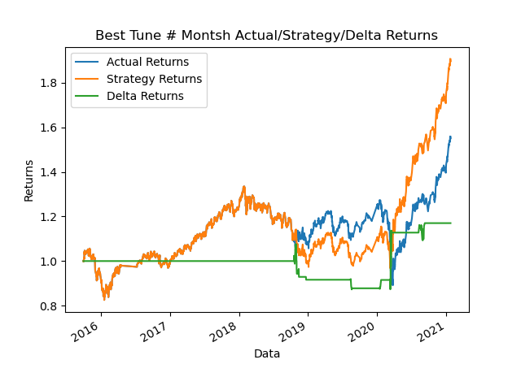

##### Columbia Fintech Bootcamp: Module #14 Challenge

---

Feature Summary: Machine Learning Trading Bot

Having the role of a financial advisor at one of the top five financial advisory firms in the world, the firm constantly competes with the other major firms to manage and automatically trade assets in a highly dynamic environment. In recent years, the firm has heavily profited by using computer algorithms that can buy and sell faster than human traders.  The speed of these transactions gives a competitive advantage early on.  In this challenge, I attempt to improve the existing algorithmic trading systems and maintain the firm’s competitive advantage in the market.


- Includes the following tasks:

    - Establish a Baseline Performance
    - Tune the Baseline Trading Algorithm
    - Evaluate a New Machine Learning Classifier
    - Create an Evaluation Report.

---

## Technologies

This project leverages python 3.9 with the following packages:
- [pandas](https://github.com/pandas-dev/pandas) - A powerful data analysis toolkit.
- [numpy](https://numpy.org/) - A core library for scientific computing in Python
- [sklearn](https://scikit-learn.org/) - Simple and efficient tools for predictive data analysis
- [imblearn](https://imbalanced-learn.org/) - Provides tools when dealing with classification with imbalanced classes
- [matplotlib](https://matplotlib.org/) - Tools for creating static, animated, and interactive visualizations
- [seaborn](https://seaborn.pydata.org/) - Statistical data visualization tools
- [hvplot](https://hvplot.holoviz.org/) - High-level API for data exploration and visualization

This project leverages python 3.9 with the following packages:

Jupyter Lab 3.3.2 is required

- *Jupyter Lab is primarily used as a web-based development environment for the notebooks, code, and data associated with this project.  Its flexible interface allows users to configure and arrange workflows in data science*

---

## Installation Guide

Before running the application first install the following dependencies.

```python
  pip install pandas
  pip install numpy
  pip install sklearn
  pip install imblearn
  pip install matplotlib
  pip install seaborn
  pip install hvplot

```
*Assumption made for module challenge: the* **sys** *and Path module will not be required to be explicitely called out in Installation guide section*

To run Jupyter Lab, need to install Anaconda:
- [Anaconda](https://docs.anaconda.com/anaconda/install/) - an open-source distribution of the Python
---

## Usage

To run the Machine Learning Trading Bot application, simply clone the repository and run the **machine_learning_trading_bot.ipynb** script in Jupyter Lab:

---

## Analysis

### Baseline Performance
- Generate trading signals using short- and long-window SMA values.<br>
-- When Actual Returns are greater than or equal to 0, generate signal to buy stock long<br>
-- When Actual Returns are less than 0, generate signal to sell stock short<br>

-- Baseline Value Counts<br><br>
>     1.0 = 2368
>    -1.0 = 1855

- Comparing Actual vs. Strategy Returns (No Predictions).<br>
-- Actual Return: 134.19%, Strategy Return: 61.43%  (Delta: -72.76%)<br>
                

**_Baseline Performance:  Actual Return: 138.71%, Strategy Return: 152.73%  (Delta: 14.02%)_**</br>


-**Using the SVC classifier model report**</br>
--Baseline Report: Actual Return: 138.71%, Strategy Return: 152.73%  (Delta: 14.02%)
>		Value Counts: 
>			Actual:    +1 count: 2288, 	-1 count: 1805
>			Predicted: +1 count: 3921, 	-1 count: 172
>		Classification Reports: 
>			Accuracy: 0.55
>			Precision: [+1] 55.85%, [-1] 43.02%
>			Recall:    [+1] 95.72%, [-1] 4.10%
>			F1-Score:  [+1] 70.54%, [-1] 7.49%

-- **_Comments_**:</br>
--- *The model predicted correctly 55% of the time that the return was going to be positve or negative</br>
--- Out of all the returns the model predicted a postive return, the model prediction this correclty 55.85% of the time</br>
--- Out of all the returns the model predicted a postive return, the model prediction this correclty 43.02% of the time</br>
--- Out of all the returns that actually generated a positive return, the model predicted this outcome 95.72% of the time</br>
--- Out of all the returns that actually generated a negative return, the model predicted this outcome 4.10% of the time</br>
--- Summary: For negative return preductions, the model performed poorly.  One attribute to this is due to the low number of predicted signals that generated a negative return (i.e. -1 predicted value count)*       

### Tune the training algorithm by adjusting the size of the training dataset

- The baseline model, used 3 months for the training data set.  For this tuning excersize, I iterated the training dataset between 1 to 12 months - and selected the dataset the provided the best returns
--Tune # of months for training dataset:<br>
>	Training Months: 1, 	Starting Day: 2015-04-02 14:45:00, 	Ending Day: 2015-05-02 14:45:00</br>
> &nbsp;&nbsp;&nbsp;&nbsp;&nbsp;&nbsp;&nbsp;&nbsp;&nbsp;&nbsp;&nbsp;&nbsp;&nbsp;&nbsp;&nbsp;&nbsp;&nbsp;Actual Return: 128.48%, Strategy Return: 135.73%  (Delta: 7.25%)</br>
>	Training Months: 2, 	Starting Day: 2015-04-02 14:45:00, 	Ending Day: 2015-06-02 14:45:00</br>
> &nbsp;&nbsp;&nbsp;&nbsp;&nbsp;&nbsp;&nbsp;&nbsp;&nbsp;&nbsp;&nbsp;&nbsp;&nbsp;&nbsp;&nbsp;&nbsp;&nbsp;Actual Return: 135.34%, Strategy Return: 141.25%  (Delta: 5.91%)</br>
>	Training Months: 3, 	Starting Day: 2015-04-02 14:45:00, 	Ending Day: 2015-07-02 14:45:00</br>
> &nbsp;&nbsp;&nbsp;&nbsp;&nbsp;&nbsp;&nbsp;&nbsp;&nbsp;&nbsp;&nbsp;&nbsp;&nbsp;&nbsp;&nbsp;&nbsp;&nbsp;Actual Return: 138.71%, Strategy Return: 152.73%  (Delta: 14.02%)</br>
>	Training Months: 4, 	Starting Day: 2015-04-02 14:45:00, 	Ending Day: 2015-08-02 14:45:00</br>
> &nbsp;&nbsp;&nbsp;&nbsp;&nbsp;&nbsp;&nbsp;&nbsp;&nbsp;&nbsp;&nbsp;&nbsp;&nbsp;&nbsp;&nbsp;&nbsp;&nbsp;Actual Return: 147.71%, Strategy Return: 120.98%  (Delta: -26.73%)</br>
>	Training Months: 5, 	Starting Day: 2015-04-02 14:45:00, 	Ending Day: 2015-09-02 14:45:00</br>
> &nbsp;&nbsp;&nbsp;&nbsp;&nbsp;&nbsp;&nbsp;&nbsp;&nbsp;&nbsp;&nbsp;&nbsp;&nbsp;&nbsp;&nbsp;&nbsp;&nbsp;Actual Return: 161.15%, Strategy Return: 171.06%  (Delta: 9.91%)</br>
>	Training Months: 6, 	Starting Day: 2015-04-02 14:45:00, 	Ending Day: 2015-10-02 14:45:00</br>
> &nbsp;&nbsp;&nbsp;&nbsp;&nbsp;&nbsp;&nbsp;&nbsp;&nbsp;&nbsp;&nbsp;&nbsp;&nbsp;&nbsp;&nbsp;&nbsp;&nbsp;Actual Return: 155.75%, Strategy Return: 190.53%  (Delta: 34.78%)</br>
>	Training Months: 7, 	Starting Day: 2015-04-02 14:45:00, 	Ending Day: 2015-11-02 14:45:00</br>
> &nbsp;&nbsp;&nbsp;&nbsp;&nbsp;&nbsp;&nbsp;&nbsp;&nbsp;&nbsp;&nbsp;&nbsp;&nbsp;&nbsp;&nbsp;&nbsp;&nbsp;Actual Return: 149.09%, Strategy Return: 177.39%  (Delta: 28.30%)</br>
>	Training Months: 8, 	Starting Day: 2015-04-02 14:45:00, 	Ending Day: 2015-12-02 14:45:00</br>
> &nbsp;&nbsp;&nbsp;&nbsp;&nbsp;&nbsp;&nbsp;&nbsp;&nbsp;&nbsp;&nbsp;&nbsp;&nbsp;&nbsp;&nbsp;&nbsp;&nbsp;Actual Return: 161.15%, Strategy Return: 127.67%  (Delta: -33.47%)</br>
>	Training Months: 9, 	Starting Day: 2015-04-02 14:45:00, 	Ending Day: 2016-01-02 14:45:00</br>
> &nbsp;&nbsp;&nbsp;&nbsp;&nbsp;&nbsp;&nbsp;&nbsp;&nbsp;&nbsp;&nbsp;&nbsp;&nbsp;&nbsp;&nbsp;&nbsp;&nbsp;Actual Return: 171.99%, Strategy Return: 112.86%  (Delta: -59.13%)</br>
>	Training Months: 10, 	Starting Day: 2015-04-02 14:45:00, 	Ending Day: 2016-02-02 14:45:00</br>
> &nbsp;&nbsp;&nbsp;&nbsp;&nbsp;&nbsp;&nbsp;&nbsp;&nbsp;&nbsp;&nbsp;&nbsp;&nbsp;&nbsp;&nbsp;&nbsp;&nbsp;Actual Return: 177.84%, Strategy Return: 174.54%  (Delta: -3.30%)</br>
>	Training Months: 11, 	Starting Day: 2015-04-02 14:45:00, 	Ending Day: 2016-03-02 14:45:00</br>
> &nbsp;&nbsp;&nbsp;&nbsp;&nbsp;&nbsp;&nbsp;&nbsp;&nbsp;&nbsp;&nbsp;&nbsp;&nbsp;&nbsp;&nbsp;&nbsp;&nbsp;Actual Return: 167.52%, Strategy Return: 167.52%  (Delta: 0.00%)</br>
>	Training Months: 12, 	Starting Day: 2015-04-02 14:45:00, 	Ending Day: 2016-04-02 14:45:00</br>
> &nbsp;&nbsp;&nbsp;&nbsp;&nbsp;&nbsp;&nbsp;&nbsp;&nbsp;&nbsp;&nbsp;&nbsp;&nbsp;&nbsp;&nbsp;&nbsp;&nbsp;		 Actual Return: 162.71%, Strategy Return: 162.71%  (Delta: 0.00%)</br>
</br>

**_Best Performance: # Training Months: 6, Actual Return: 155.75%, Strategy Return: 190.53%  (Delta: 34.78%)_**</br>



--Tune # Months Report: Best # of months: 6, Actual Return: 155.75%, Strategy Return: 190.53%  (Delta: 34.78%)
>		Value Counts: 
>			Actual:    +1 count: 2212, 	-1 count: 1732
>			Predicted: +1 count: 3857, 	-1 count: 87
>		Classification Reports: 
>			Accuracy: 0.56
>			Precision: [+1] 56.09%, [-1] 44.83%
>			Recall:    [+1] 97.83%, [-1] 2.25%
>			F1-Score:  [+1] 71.30%, [-1] 4.29%
-- **_Comments_**:</br>
--- *The model predicted correctly 56% of the time that the return was going to be positve or negative</br>
--- Out of all the returns the model predicted a postive return, the model prediction this correclty 56.09% of the time</br>
--- Out of all the returns the model predicted a postive return, the model prediction this correclty 44.83% of the time</br>
--- Out of all the returns that actually generated a positive return, the model predicted this outcome 97.83% of the time</br>
--- Out of all the returns that actually generated a negative return, the model predicted this outcome 2.25% of the time</br>
--- Summary: For negative return preductions, the model performed poorly.  One attribute to this is due to the low number of predicted signals that generated a negative return (i.e. -1 predicted value count)* 


### Tune the trading algorithm by adjusting the SMA input features.

- For this tuning excersize, varied the permutations of the short window duration (from 4 to 20, in increment steps of 4), and the long window duration (from 50 to 200, in increment steps of 50).
--Tune # of SMA months:<br>
>	short window days: 4, long window days: 50</br>
>	&nbsp;&nbsp;&nbsp;&nbsp;&nbsp;&nbsp;&nbsp;&nbsp;&nbsp;&nbsp;&nbsp;&nbsp;&nbsp;&nbsp;&nbsp;&nbsp;&nbsp; Actual Return: 161.30%, Strategy Return: 159.00%  (Delta: -2.30%)</br>
>	short window days: 4, long window days: 100</br>
>	&nbsp;&nbsp;&nbsp;&nbsp;&nbsp;&nbsp;&nbsp;&nbsp;&nbsp;&nbsp;&nbsp;&nbsp;&nbsp;&nbsp;&nbsp;&nbsp;&nbsp; Actual Return: 155.75%, Strategy Return: 190.53%  (Delta: 34.78%)</br>
>	short window days: 4, long window days: 150</br>
>	&nbsp;&nbsp;&nbsp;&nbsp;&nbsp;&nbsp;&nbsp;&nbsp;&nbsp;&nbsp;&nbsp;&nbsp;&nbsp;&nbsp;&nbsp;&nbsp;&nbsp; Actual Return: 149.22%, Strategy Return: 187.15%  (Delta: 37.93%)</br>
>	short window days: 4, long window days: 200</br>
>	&nbsp;&nbsp;&nbsp;&nbsp;&nbsp;&nbsp;&nbsp;&nbsp;&nbsp;&nbsp;&nbsp;&nbsp;&nbsp;&nbsp;&nbsp;&nbsp;&nbsp; Actual Return: 168.96%, Strategy Return: 143.75%  (Delta: -25.20%)</br>
>	short window days: 8, long window days: 50</br>
>	&nbsp;&nbsp;&nbsp;&nbsp;&nbsp;&nbsp;&nbsp;&nbsp;&nbsp;&nbsp;&nbsp;&nbsp;&nbsp;&nbsp;&nbsp;&nbsp;&nbsp; Actual Return: 161.30%, Strategy Return: 161.30%  (Delta: 0.00%)</br>
>	short window days: 8, long window days: 100</br>
>	&nbsp;&nbsp;&nbsp;&nbsp;&nbsp;&nbsp;&nbsp;&nbsp;&nbsp;&nbsp;&nbsp;&nbsp;&nbsp;&nbsp;&nbsp;&nbsp;&nbsp; Actual Return: 155.75%, Strategy Return: 188.58%  (Delta: 32.82%)</br>
>	short window days: 8, long window days: 150</br>
>	&nbsp;&nbsp;&nbsp;&nbsp;&nbsp;&nbsp;&nbsp;&nbsp;&nbsp;&nbsp;&nbsp;&nbsp;&nbsp;&nbsp;&nbsp;&nbsp;&nbsp; Actual Return: 149.22%, Strategy Return: 173.33%  (Delta: 24.11%)</br>
>	short window days: 8, long window days: 200</br>
>	&nbsp;&nbsp;&nbsp;&nbsp;&nbsp;&nbsp;&nbsp;&nbsp;&nbsp;&nbsp;&nbsp;&nbsp;&nbsp;&nbsp;&nbsp;&nbsp;&nbsp; Actual Return: 168.96%, Strategy Return: 125.69%  (Delta: -43.27%)</br>
>	short window days: 12, long window days: 50</br>
>	&nbsp;&nbsp;&nbsp;&nbsp;&nbsp;&nbsp;&nbsp;&nbsp;&nbsp;&nbsp;&nbsp;&nbsp;&nbsp;&nbsp;&nbsp;&nbsp;&nbsp; Actual Return: 161.30%, Strategy Return: 161.30%  (Delta: 0.00%)</br>
>	short window days: 12, long window days: 100</br>
>	&nbsp;&nbsp;&nbsp;&nbsp;&nbsp;&nbsp;&nbsp;&nbsp;&nbsp;&nbsp;&nbsp;&nbsp;&nbsp;&nbsp;&nbsp;&nbsp;&nbsp; Actual Return: 155.75%, Strategy Return: 143.05%  (Delta: -12.71%)</br>
>	short window days: 12, long window days: 150</br>
>	&nbsp;&nbsp;&nbsp;&nbsp;&nbsp;&nbsp;&nbsp;&nbsp;&nbsp;&nbsp;&nbsp;&nbsp;&nbsp;&nbsp;&nbsp;&nbsp;&nbsp; Actual Return: 149.22%, Strategy Return: 159.18%  (Delta: 9.96%)</br>
>	short window days: 12, long window days: 200</br>
>	&nbsp;&nbsp;&nbsp;&nbsp;&nbsp;&nbsp;&nbsp;&nbsp;&nbsp;&nbsp;&nbsp;&nbsp;&nbsp;&nbsp;&nbsp;&nbsp;&nbsp; Actual Return: 168.96%, Strategy Return: 109.29%  (Delta: -59.66%)</br>
>	short window days: 16, long window days: 50</br>
>	&nbsp;&nbsp;&nbsp;&nbsp;&nbsp;&nbsp;&nbsp;&nbsp;&nbsp;&nbsp;&nbsp;&nbsp;&nbsp;&nbsp;&nbsp;&nbsp;&nbsp; Actual Return: 161.30%, Strategy Return: 161.30%  (Delta: 0.00%)</br>
>	short window days: 16, long window days: 100</br>
>	&nbsp;&nbsp;&nbsp;&nbsp;&nbsp;&nbsp;&nbsp;&nbsp;&nbsp;&nbsp;&nbsp;&nbsp;&nbsp;&nbsp;&nbsp;&nbsp;&nbsp; Actual Return: 155.75%, Strategy Return: 139.27%  (Delta: -16.49%)</br>
>	short window days: 16, long window days: 150</br>
>	&nbsp;&nbsp;&nbsp;&nbsp;&nbsp;&nbsp;&nbsp;&nbsp;&nbsp;&nbsp;&nbsp;&nbsp;&nbsp;&nbsp;&nbsp;&nbsp;&nbsp; Actual Return: 149.22%, Strategy Return: 141.96%  (Delta: -7.26%)</br>
>	short window days: 16, long window days: 200</br>
>	&nbsp;&nbsp;&nbsp;&nbsp;&nbsp;&nbsp;&nbsp;&nbsp;&nbsp;&nbsp;&nbsp;&nbsp;&nbsp;&nbsp;&nbsp;&nbsp;&nbsp; Actual Return: 168.96%, Strategy Return: 114.46%  (Delta: -54.50%)</br>
>	short window days: 20, long window days: 50</br>
>	&nbsp;&nbsp;&nbsp;&nbsp;&nbsp;&nbsp;&nbsp;&nbsp;&nbsp;&nbsp;&nbsp;&nbsp;&nbsp;&nbsp;&nbsp;&nbsp;&nbsp; Actual Return: 161.30%, Strategy Return: 161.30%  (Delta: 0.00%)</br>
>	short window days: 20, long window days: 100</br>
>	&nbsp;&nbsp;&nbsp;&nbsp;&nbsp;&nbsp;&nbsp;&nbsp;&nbsp;&nbsp;&nbsp;&nbsp;&nbsp;&nbsp;&nbsp;&nbsp;&nbsp; Actual Return: 155.75%, Strategy Return: 152.72%  (Delta: -3.03%)</br>
>	short window days: 20, long window days: 150</br>
>	&nbsp;&nbsp;&nbsp;&nbsp;&nbsp;&nbsp;&nbsp;&nbsp;&nbsp;&nbsp;&nbsp;&nbsp;&nbsp;&nbsp;&nbsp;&nbsp;&nbsp; Actual Return: 149.22%, Strategy Return: 146.85%  (Delta: -2.37%)</br>
>	short window days: 20, long window days: 200</br>
>	&nbsp;&nbsp;&nbsp;&nbsp;&nbsp;&nbsp;&nbsp;&nbsp;&nbsp;&nbsp;&nbsp;&nbsp;&nbsp;&nbsp;&nbsp;&nbsp;&nbsp; Actual Return: 168.96%, Strategy Return: 137.25%  (Delta: -31.71%)</br>

**_Best Performance: short window days: 4, # of long window days: 150, Actual Return: 149.22%, Strategy Return: 187.15%  (Delta: 37.93%)_**</br>


--Tune # SMA Report: Best Performance: # of short window days: 4, # of long window days: 150, Actual Return: 149.22%, Strategy Return: 187.15%  (Delta: 37.93%)
>		Value Counts: 
>			Actual:    +1 count: 2192, 	-1 count: 1717
>			Predicted: +1 count: 3785, 	-1 count: 124
>		Classification Reports: 
>			Accuracy: 0.56
>			Precision: [+1] 56.05%, [-1] 43.55%
>			Recall:    [+1] 96.81%, [-1] 3.14%
>			F1-Score:  [+1] 70.99%, [-1] 5.86%
-- **_Comments_**:</br>
--- *The model predicted correctly 56% of the time that the return was going to be positve or negative</br>
--- Out of all the returns the model predicted a postive return, the model prediction this correclty 56.04% of the time</br>
--- Out of all the returns the model predicted a postive return, the model prediction this correclty 43.55% of the time</br>
--- Out of all the returns that actually generated a positive return, the model predicted this outcome 96.81% of the time</br>
--- Out of all the returns that actually generated a negative return, the model predicted this outcome 3.13% of the time</br>
--- Summary: For negative return preductions, the model performed poorly.  One attribute to this is due to the low number of predicted signals that generated a negative return (i.e. -1 predicted value count)* 

### Evaluate a New Machine Learning Classifier.
- The following Machine Learning Models were evaluated: "SVC", "LogisticRegression", "DecisionTreeClassifier", "RandomForestClassifier", "KNeighborsClassifier", "GradientBoostingClassifier", "SGDClassifier", "AdaBoostClassifier"

--Results:<br>
>	ML Model: SVC</br>
>	&nbsp;&nbsp;&nbsp;&nbsp;&nbsp;&nbsp;&nbsp;&nbsp;&nbsp;&nbsp;&nbsp;&nbsp;&nbsp;&nbsp;&nbsp;&nbsp;&nbsp;  Actual Return: 138.71%, Strategy Return: 152.73%  (Delta: 14.02%)</br>
>	ML Model: LogisticRegression</br>
>	&nbsp;&nbsp;&nbsp;&nbsp;&nbsp;&nbsp;&nbsp;&nbsp;&nbsp;&nbsp;&nbsp;&nbsp;&nbsp;&nbsp;&nbsp;&nbsp;&nbsp;  Actual Return: 138.71%, Strategy Return: 114.62%  (Delta: -24.09%)</br>
>	ML Model: DecisionTreeClassifier</br>
>	&nbsp;&nbsp;&nbsp;&nbsp;&nbsp;&nbsp;&nbsp;&nbsp;&nbsp;&nbsp;&nbsp;&nbsp;&nbsp;&nbsp;&nbsp;&nbsp;&nbsp;  Actual Return: 138.71%, Strategy Return: 85.68%  (Delta: -53.02%)</br>
>	ML Model: RandomForestClassifier</br>
>	&nbsp;&nbsp;&nbsp;&nbsp;&nbsp;&nbsp;&nbsp;&nbsp;&nbsp;&nbsp;&nbsp;&nbsp;&nbsp;&nbsp;&nbsp;&nbsp;&nbsp;  Actual Return: 138.71%, Strategy Return: 114.29%  (Delta: -24.41%)</br>
>	ML Model: KNeighborsClassifier</br>
>	&nbsp;&nbsp;&nbsp;&nbsp;&nbsp;&nbsp;&nbsp;&nbsp;&nbsp;&nbsp;&nbsp;&nbsp;&nbsp;&nbsp;&nbsp;&nbsp;&nbsp;  Actual Return: 138.71%, Strategy Return: 168.40%  (Delta: 29.70%)</br>
>	ML Model: GradientBoostingClassifier</br>
>	&nbsp;&nbsp;&nbsp;&nbsp;&nbsp;&nbsp;&nbsp;&nbsp;&nbsp;&nbsp;&nbsp;&nbsp;&nbsp;&nbsp;&nbsp;&nbsp;&nbsp;  Actual Return: 138.71%, Strategy Return: 50.87%  (Delta: -87.83%)</br>
>	ML Model: SGDClassifier</br>
>	&nbsp;&nbsp;&nbsp;&nbsp;&nbsp;&nbsp;&nbsp;&nbsp;&nbsp;&nbsp;&nbsp;&nbsp;&nbsp;&nbsp;&nbsp;&nbsp;&nbsp;  Actual Return: 138.71%, Strategy Return: 57.13%  (Delta: -81.58%)</br>
>	ML Model: AdaBoostClassifier</br>
>	&nbsp;&nbsp;&nbsp;&nbsp;&nbsp;&nbsp;&nbsp;&nbsp;&nbsp;&nbsp;&nbsp;&nbsp;&nbsp;&nbsp;&nbsp;&nbsp;&nbsp;  Actual Return: 138.71%, Strategy Return: 123.38%  (Delta: -15.33%)</br>

**_Best Performance: ML Model: KNeighborsClassifier, Actual Return: 138.71%, Strategy Return: 168.40%  (Delta: 29.70%)_**</br>


-- Tune ML Model Report: Best Performance: ML Model: KNeighborsClassifier, Actual Return: 138.71%, Strategy Return: 168.40%  (Delta: 29.70%)
>		Value Counts: 
>			Actual:    +1 count: 2288, 	-1 count: 1804
>			Predicted: +1 count: 2522, 	-1 count: 1570
>		Classification Reports: 
>			Accuracy: 0.51
>			Precision: [+1] 55.95%, [-1] 44.18%
>			Recall:    [+1] 61.67%, [-1] 38.45%
>			F1-Score:  [+1] 58.67%, [-1] 41.11%
-- **_Comments_**:</br>
--- *The model predicted correctly 51% of the time that the return was going to be positve or negative</br>
--- Out of all the returns the model predicted a postive return, the model prediction this correclty 55.95% of the time</br>
--- Out of all the returns the model predicted a postive return, the model prediction this correclty 44.18% of the time</br>
--- Out of all the returns that actually generated a positive return, the model predicted this outcome 61.67% of the time</br>
--- Out of all the returns that actually generated a negative return, the model predicted this outcome 38.45% of the time</br>
--- Summary: This model had the best overall recall values.  It was able to account for negative returns better than any other model* 
---

## Contributors

Contributors:
- Stratis Gavnoudias
---

## License

GNU GENERAL PUBLIC LICENSE Version 3, 29 June 2007
